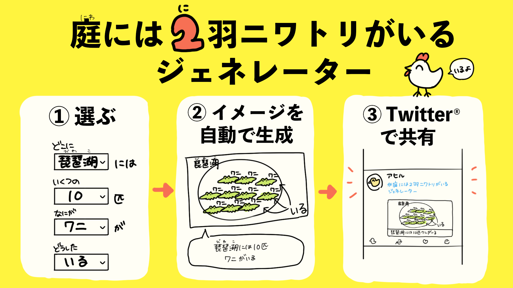
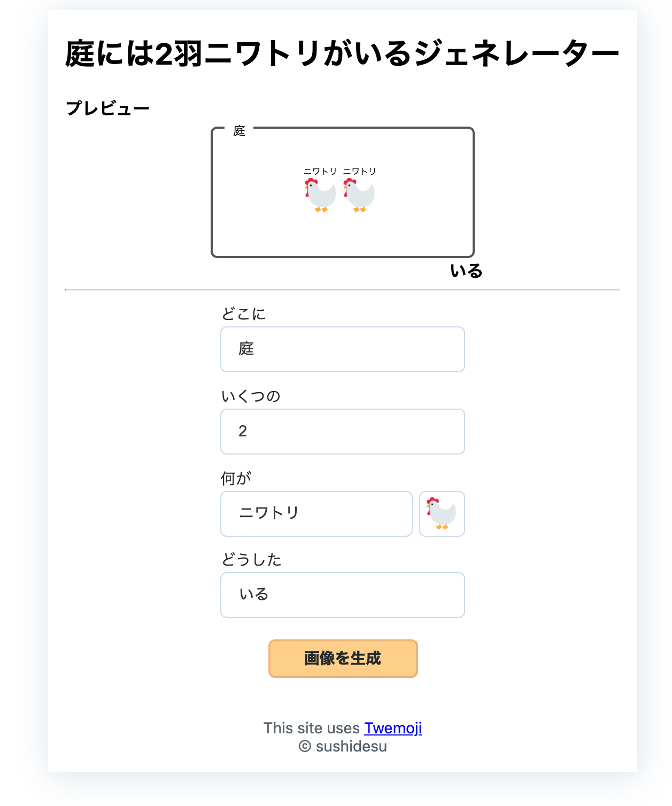
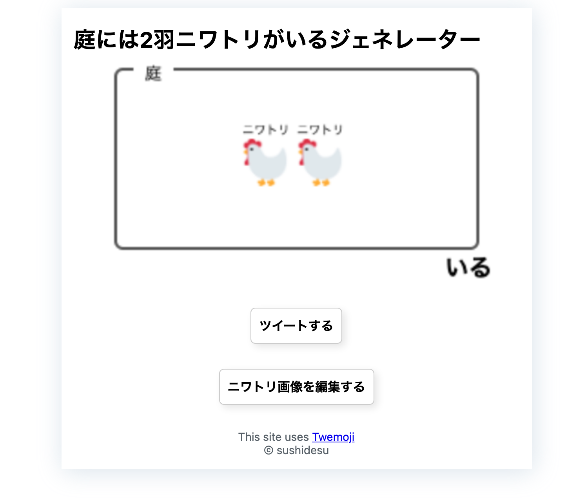
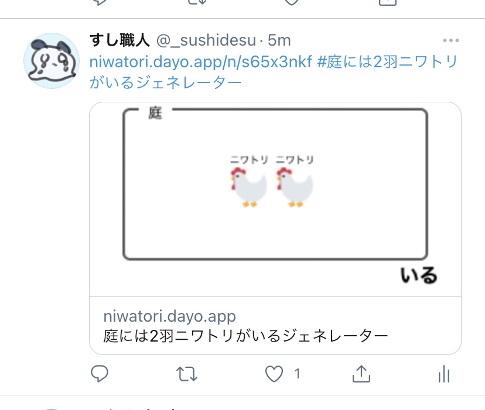

# 庭には2羽ニワトリがいるジェネレーターを1週間で作った話

## 2021/05/30

---

# 自己紹介

- Tomoki Ishihara ([@_sushidesu](https://twitter.com/_sushidesu))
- 北海道のクリーニング・雑貨を扱う会社 (2020/08〜)
- 社内向けの会計システムを開発中
- Next.js, Firebase, Tailwind CSS, GraphCMS ← 好き

---

# 今日話すこと

---

# 今日話すこと

- 庭には2羽ニワトリがいるジェネレーターとは？
- なぜ1週間で作ったか？
- まとめ

---

# 庭には2羽ニワトリがいるジェネレーターとは？

---

# 庭には2羽ニワトリがいるジェネレーターとは

## → OGP画像シェアする系サービス

---

---

## 選ぶ → 作る → シェアする

---

## 選ぶ

---

## 作る

---

## シェアする

---

## 実際の投稿

---

# なぜ1週間で作ったか

---

# なぜ1週間で作ったか

- web1week (一週間でWebサービスを作るイベント)
  - お題がある
  - 「Home」
  - 「Like」
  - 「2」 (参加: 「庭には〜」)
  - 「増やす」 (参加: 「クッキークリッカーメーカー」)

---

## web1weekのいいところ

### 期限がある (1週間)

→ 期限があると、完成する

---

# まとめ

---

# まとめ

- イベントに参加すると、サービスが一つできる
- おすすめイベント → web1week

---

# 関連リンク

- [庭には2羽ニワトリがいるジェネレーター](https://niwatori.dayo.app)
- web1week
  - [Webサービスを1週間で作るイベント開催の概要 - Crieit](https://crieit.net/posts/Web-1)
  - [だら🎄リリース！ノベルゲーム風ムービーメーカーさん (@dala00) / Twitter](https://twitter.com/dala00)
- 実装の参考
  - [ソースコードからOGPを生成しシェアするOgp as a Serviceを作った(そして飽きたのでコードを公開する)](https://blog.ojisan.io/share-ogp)
